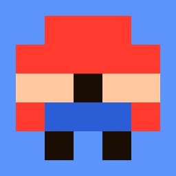
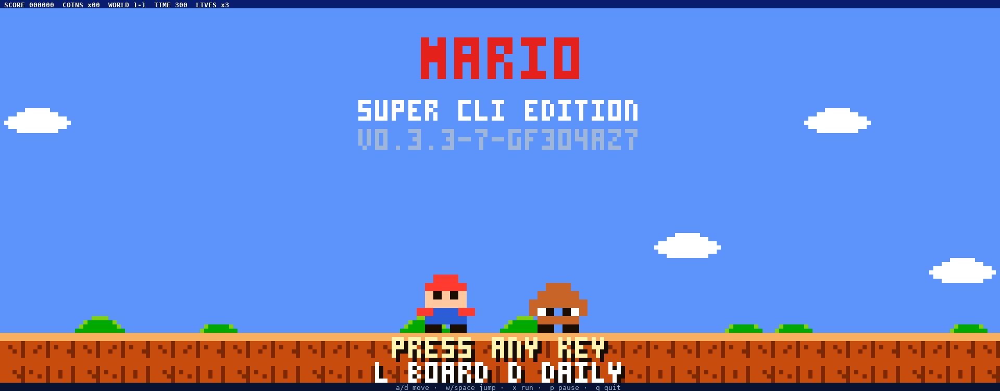
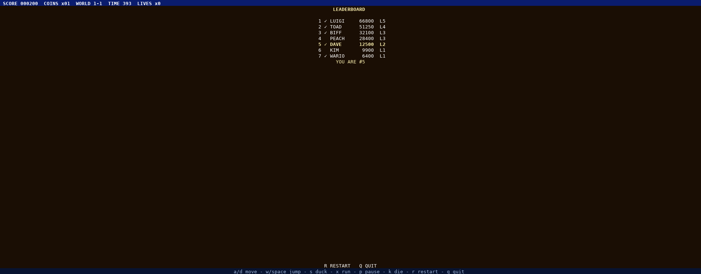
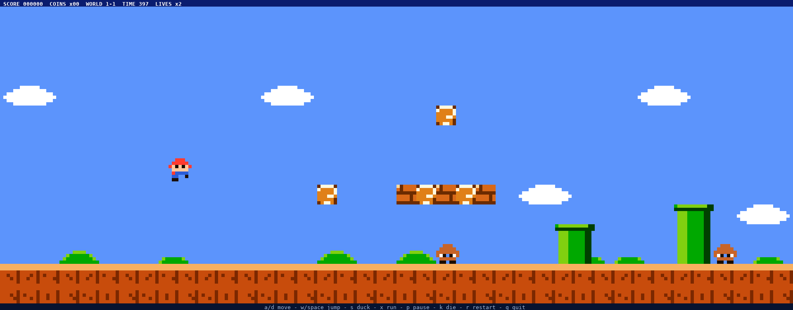
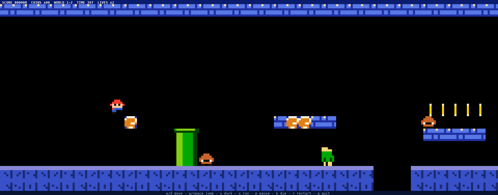
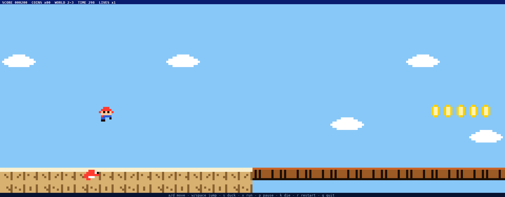
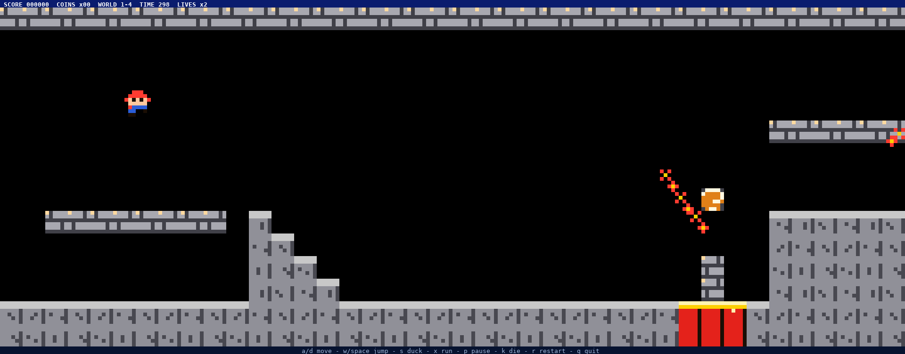
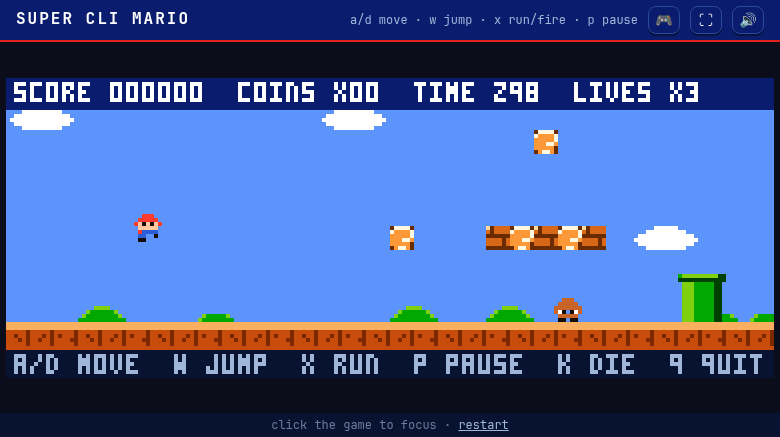
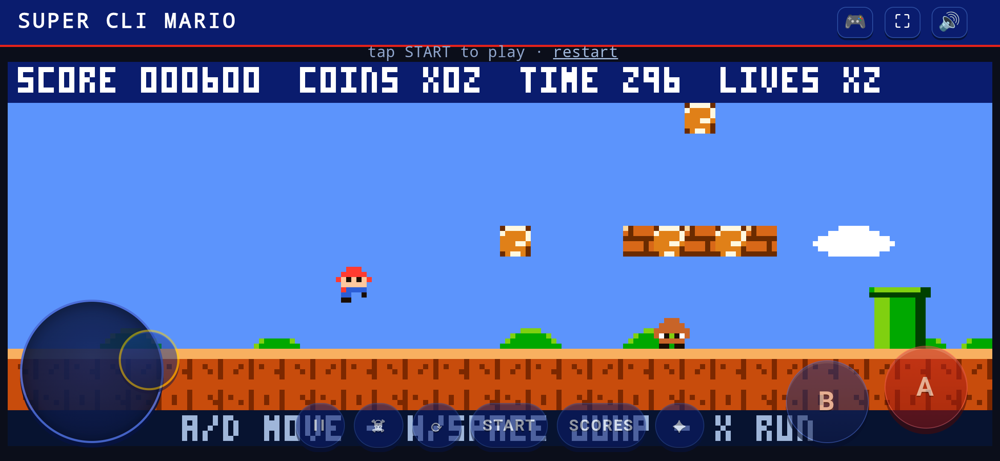
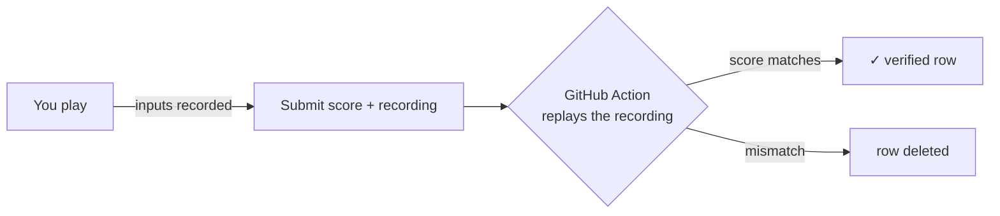

<p align="center">
  
</p>

<h1 align="center">SUPER CLI MARIO</h1>

<p align="center">
  A complete Super Mario Bros–style platformer that runs <b>in your terminal</b> —<br />
  and in the browser, on your phone, as a <code>.deb</code>/AUR/Nix package, and bootable on bare metal via UEFI.
</p>

<p align="center">
  <a href="https://github.com/Daviey/mario/actions/workflows/ci.yml"></a>
  <a href="https://github.com/Daviey/mario/releases/latest"></a>
  
  
  <a href="LICENSE"></a>
</p>

<p align="center">
  
</p>

Seven hand-built levels across two worlds and four themes — overworld, underground, sky and castle — with mushrooms, fire flowers, star power, hidden blocks, piranha plants, paratroopas, fire bars and lava. All of it drawn as **true-color pixel art using half-block terminal glyphs**: two square pixels per character cell, a custom 3×5 arcade font for the HUD, and a graceful 16-color fallback for basic terminals.

The engine is **fully deterministic** — no randomness, no wall clock — so the same input sequence always reproduces the same game. That's not just a party trick: it's the backbone of an **online leaderboard where every score is verified by replay** (more on that below).

## Screenshots

<p>
  
  
</p>

| Overworld (1-1) | Underground (1-2) |
|:---:|:---:|
|  |  |

| Sky (2-3) | Castle (2-4) |
|:---:|:---:|
|  |  |

The same code compiles to a browser build (Go → WebAssembly, installable PWA with offline support, WebAudio sound and its own touch gamepad on phones):

<p>
  
  
</p>

## Quick start

**Terminal** (Linux/macOS/Windows, x86-64 + arm64):

```sh
git clone https://github.com/Daviey/mario && cd mario
make run          # or: make build && ./mario
```

Or grab a static binary, a `.deb`, the Android APK or the web bundle from the
[latest release](https://github.com/Daviey/mario/releases/latest). Nix users:
`nix build` from the flake in this repo; Arch users: `makepkg -p packaging/aur/PKGBUILD`.

**Browser:** play it at **[daviey.github.io/mario](https://daviey.github.io/mario/)** — no install, works offline once loaded, touch controls on phones.

**Bare metal:** `make efi` produces a single-file UEFI executable that boots straight into the game — no OS required.

### Controls

| Key | Action |
|---|---|
| `a`/`d` or arrows | move |
| `w`, space, up | jump |
| `x` (hold) | run · fire when powered |
| `p` / `q` / `k` | pause · quit · die on demand |
| `l` | leaderboard (from the title screen) |
| `d` | daily challenge (from the title screen) |
| `r` | restart after game over |

Play your own levels, too — levels are plain ASCII text files: `./mario -level mylevel.txt`.

## A leaderboard nobody can cheat

Every run is recorded as a compressed input log. When you submit a score, the
recording goes with it, and a verifier **replays your inputs against the same
deterministic engine and keeps the row only if it reproduces the claimed
score, level and engine version**:



Submissions sit behind proof-of-work, per-IP and per-device rate limits, and
row-level security — the board itself is a plain Supabase/PostgREST table, so
there's no game server to run or trust. Verified rows carry a green ✓ on every
board surface (terminal, web, APK).

**Daily mode** generates a new challenge level every day from the date seed —
same level for everyone, structurally checked to be solvable, with its own
leaderboard.

## How it's built

* **Zero dependencies.** The whole game — engine, renderer, leaderboard
  client, WASM target, even the `.deb` packager — is Go standard library.
* **Terminal renderer.** Truecolor half-block pixels, diffed per frame; falls
  back to 16-color ANSI. Speaks the kitty keyboard protocol for real
  press/repeat/release events, with legacy key-repeat inference for terminals
  that don't.
* **Deterministic engine.** Fixed 60 Hz tick, pure `Game.Update(Input)`
  transition — the determinism tests byte-compare full rendered runs, and the
  replay verifier leans on the same property.
* **One codebase, many targets.** `make release` cross-compiles five OS/arch
  pairs; `make web` produces the static PWA; `make apk` wraps it for Android;
  `make deb` / `packaging/aur` / `flake.nix` package it for distros; `make efi`
  builds the bootable image. The Windows exe icon is rendered from the game's
  own sprite data.
* **Importable as a library.** The root package is a facade — `mario.New`,
  `Feed`, `Step`, `Run` — so you can embed the game as an easter egg in your
  own Go program.

## Development

```sh
make build     # native binary (CGO off, fully static)
make check     # fmtcheck + vet + test — the CI gate
make race      # tests under the race detector
make cover     # coverage summary
make web       # static browser build in dist/web
make test      # go test ./...
```

Stdlib `testing` only; assertions are programmatic (pixel reads, ANSI output
contains, geometry checks). The suite includes determinism tests, viewport
size sweeps, and offline fakes for the leaderboard backend.

## License

[MIT](LICENSE)
