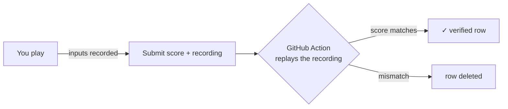

<p align="center">
  
</p>

<h1 align="center">SUPER CLI MARIO</h1>

<p align="center">
  A complete Super Mario Bros-style platformer that runs <b>in your terminal</b>,<br />
  in the browser, on your phone, over plain <code>ssh</code> or <code>mosh</code> with no client install,<br />
  as a <code>.deb</code>/<code>.rpm</code>/AUR/Nix package, AppImage or Android APK,<br />
  and bootable on bare metal via UEFI.
</p>

<p align="center">
  <a href="https://github.com/Daviey/mario/actions/workflows/ci.yml"></a>
  <a href="https://github.com/Daviey/mario/releases/latest"></a>
  
  
  <a href="LICENSE"></a>
</p>

<p align="center">
  
</p>

Seven hand-built levels across two worlds and four themes (overworld, underground, sky, castle), with mushrooms, fire flowers, star power, hidden blocks, piranha plants, paratroopas, fire bars and lava. All of it drawn as **truecolor pixel art using half-block terminal glyphs**: two square pixels per character cell, a custom 3×5 arcade font for the HUD, and a 16-color fallback for basic terminals.

The engine is **fully deterministic**: no randomness, no wall clock, so the same input sequence always reproduces the same game. The online leaderboard is built on that property; every score is verified by replay.

## Screenshots

<p>
  
  
</p>

| Overworld (1-1) | Underground (1-2) |
|:---:|:---:|
|  |  |

| Sky (2-3) | Castle (2-4) |
|:---:|:---:|
|  |  |

The same code compiles to a browser build (Go to WebAssembly): an installable PWA with offline support, WebAudio sound, and its own touch gamepad on phones.

<p>
  
  
</p>

## Quick start

**Terminal** (Linux, macOS, Windows, the BSDs, Solaris/illumos; x86-64, arm64, riscv64, 32-bit arm/x86):

```sh
go install github.com/Daviey/mario/cmd/mario@latest
```

Or build from source (needs Go 1.22+; no toolchain? Grab a prebuilt binary below):

```sh
git clone https://github.com/Daviey/mario && cd mario
make run          # or: make build && ./mario
```

Prebuilt binaries, `.deb`/`.rpm`, the AppImage, the Android APK, the macOS app and the web
bundle are all on the [latest release](https://github.com/Daviey/mario/releases/latest).
AppImage: `chmod +x mario_*_amd64.AppImage && ./mario_*_amd64.AppImage` (on NixOS:
`nix shell nixpkgs#appimage-run -c appimage-run mario_*_amd64.AppImage`). Nix users: `nix build`
from the flake in this repo; Arch users: `makepkg -p packaging/aur/PKGBUILD`.

**macOS app:** unzip `mario_<version>_macos.app.zip` from the release, then right-click and
**Open** it the first time (Gatekeeper has to bless the unsigned binary). Or skip the bundle and
run the binary from Terminal: `Mario.app/Contents/MacOS/mario`.

**iOS:** sideload `mario_<version>_ios_unsigned.ipa` with Sideloadly/AltStore, which re-signs it
with your Apple ID (free accounts expire every 7 days). Or just play the web build; it's the
same game.

**Browser:** play it at **[mario.baby](https://mario.baby)** or **[daviey.github.io/mario](https://daviey.github.io/mario/)**: no install, works offline once loaded, touch controls on phones.

**Bare metal:** `make efi` produces a single-file UEFI executable that boots straight into the game; no OS required.

**Legacy BIOS / USB:** `make iso` wraps the same payload in a BIOS-bootable hybrid ISO, and `make iso-qemu` smoke-boots it headless.

**Over SSH:** `mario -serve :1985` turns any machine into an arcade. Players connect with
`ssh -t yourhost -p 1985` and just play: any username works, there are no accounts and nothing
to install. (1985 is the year Super Mario Bros. shipped.) The server speaks the whole SSH
protocol from the standard library (curve25519 key exchange, ed25519 host key, AES-CTR + HMAC)
and offers exactly one service: the game. No shell, no exec, no forwarding; every connection
gets its own game, leaderboard identity and replay-verified scores. `-hostkey /path` pins the
host key across restarts, and `-basic` falls back to 16-color output.

**Over mosh:** add `-mosh auto` (plus `-mosh-ports 60000:60100` in the firewall) and players
connect with `mosh yourhost`. Same game over mosh's UDP protocol: roaming between Wi-Fi and
cellular, surviving laptop sleep/resume, interpolating over packet loss. Input feel is tuned for
both transports; on slow links the server drops rendered frames, never simulation ticks, so
keystrokes keep flowing.

The server also **identifies your terminal and picks the right color depth**, with no config
and no env vars. GNOME Terminal, iTerm2, kitty, WezTerm, ghostty, Konsole and friends get full
truecolor automatically (even through mosh, which normally flattens everything to 256 colors);
Terminal.app gets an honest 16-color palette, because that's what it has. When all sessions are
taken, extra players queue with a live position and ETA instead of bouncing.

Play it right now, over IPv4 or IPv6: `ssh -t mario.baby` (port 22), `ssh -t mario.baby -p 1985`,
or roam with `mosh mario.baby`.

### Controls

| Key | Action |
|---|---|
| `a`/`d` or arrows | move |
| `w`, space, up | jump |
| `x` (hold) | run · fire when powered |
| `p` / `q` / `k` | pause · quit · die on demand |
| `l` | leaderboard (from the title screen) |
| `d` | daily challenge (from the title screen) |
| `r` | restart after game over |

Sound comes through the terminal bell: coins, stomps, power-ups, level clear, locally, over ssh
and even through mosh. Terminals map it to a beep, flash or urgency hint, and `-nobell` silences
it. (The browser build synthesizes its own WebAudio soundtrack instead.)

`mario -cheats` lifts the two-fireball cap, but the run is deliberately unrecorded and can never
touch the leaderboard.

Levels are plain ASCII text files, so you can play your own: `./mario -level mylevel.txt`.

## A leaderboard nobody can cheat

Every run is recorded as a compressed input log. When you submit a score, the
recording goes with it, and a verifier **replays your inputs against the same
deterministic engine and keeps the row only if it reproduces the claimed
score, level and engine version**:



Submissions sit behind proof-of-work, per-IP and per-device rate limits, and
row-level security; the board itself is a plain Supabase/PostgREST table, so
there's no game server to run or trust. Verified rows carry a green ✓ on every
board surface (terminal, web, APK). You can also read the board without
playing: `mario -scores`.

**Daily mode** generates a new challenge level every day from the date seed:
same level for everyone, structurally checked to be solvable, with its own
leaderboard. Enter it from the title screen (`d`), or start straight into a
run with `mario -daily`.

## How it's built

* Zero dependencies. The whole game (engine, renderer, leaderboard client,
  WASM target, even the `.deb` packager) is Go standard library.
* The renderer draws truecolor half-block pixels and streams a bandwidth-minimal
  diff of only what changed, about 1.2 KB per frame on a 200-column terminal at
  60 fps (~73 KiB/s, roughly a third of that in 16-color mode), so remote play
  feels local. It falls back to 16-color ANSI, follows terminal resizes live,
  and speaks the kitty keyboard protocol for real press/repeat/release events,
  with legacy key-repeat inference for terminals that don't.
* A fixed 60 Hz tick through a pure `Game.Update(Input)` transition drives the
  engine. The determinism tests byte-compare full rendered runs, and the replay
  verifier leans on the same property.
* `make release` cross-compiles 17 OS/arch pairs from one codebase; `make web`
  produces the static PWA, `make apk` wraps it for Android, `make deb` /
  `make rpm` / AUR / Nix package it for distros, and `make efi` / `make iso`
  build the bootable images. The Windows exe icon is rendered from the game's
  own sprite data.
* `mario -serve` implements its own SSH server on the standard library:
  transport, key exchange, `none` auth, session channels. It proxies the mosh
  roaming handshake (never exec'ing the client's own command line), probes each
  terminal's real color capabilities via device-attribute queries, and keeps
  the 60 Hz simulation honest under backpressure and capacity pressure.
* The root package is a small facade (`mario.New`, `Feed`, `Step`, `Run`), so
  you can embed the game as an easter egg in your own Go program.

## Development

```sh
make build     # native binary (CGO off, fully static)
make check     # fmtcheck + vet + test (the CI gate)
make race      # tests under the race detector
make cover     # coverage summary
make web       # static browser build in dist/web
make test      # go test ./...
```

Stdlib `testing` only; assertions are programmatic (pixel reads, ANSI output
contains, geometry checks). The suite includes determinism tests, viewport
size sweeps, and offline fakes for the leaderboard backend.

## License

[MIT](LICENSE)
